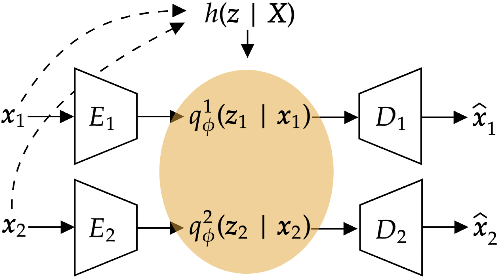

# MMVM VAE: Hippocampal Neural Activities

This is the Hippocampal Neural Activities experiment part of the official code release for the NeurIPS 2024 paper [Unity by Diversity: Improved Representation Learning for Multimodal VAEs](https://arxiv.org/abs/2403.05300).

Comments and questions are always welcome. Just reach out to us!

## MMVM Prior
In this paper, we introduce the *MMVM VAE*, a novel multimodal VAE formulation using a shoft-sharing of information between modalities.

The proposed method is based on the MMVM prior $h(\mathbf{z} | \mathbf{X})$ that acts on the unimodal posterior approximations $q(\mathbf{z}_m | \mathbf{x}_m)$:



# Installation

To be able to run the experiments and reproduce the results shown in the paper, you need to install the ```mvvae``` conda environments using

```
conda env create -f environment.yml
```

# Data

The data can be downloaded through the link: https://datadryad.org/stash/dataset/doi:10.7280/D14X30

# Benchmark Experiments

To run the experiment, you can use the following command from the root dir of the repository after having activated the conda environment

```
python main_rats_wsl.py model="mixedprior"
```

We use [WandB](https://wandb.ai/) and [Hydra](https://hydra.cc/) for logging and configuring our experiments.
So,

- make sure to have a WandB account
- you can easily set any experiment parameters either over the command line or using ```config.yaml``` files


## Citation
If you use our model in your work, please cite us using the following citation

```
@inproceedings{sutter2024,
  title={Unity by Diversity: Improved Representation Learning in Multimodal VAEs},
  author={Sutter, Thomas M and Meng, Yang and Agostini, Andrea and Chopard, Daphné and Fortin, Norbert and Vogt, Julia E. and Shahbaba, Babak and Mandt, Stephan},
  year = {2024},
  booktitle = {arxiv},
}
```


## Questions
For any questions or requests, please reach out to:

[Thomas Sutter](https://thomassutter.github.io/) [(thomas.sutter@inf.ethz.ch)](mailto:thomas.sutter@inf.ethz.ch)


[Yang Meng]() [(mengy13@uci.edu)](mailto:mengy13@uci.edu)
